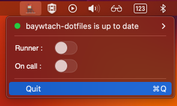
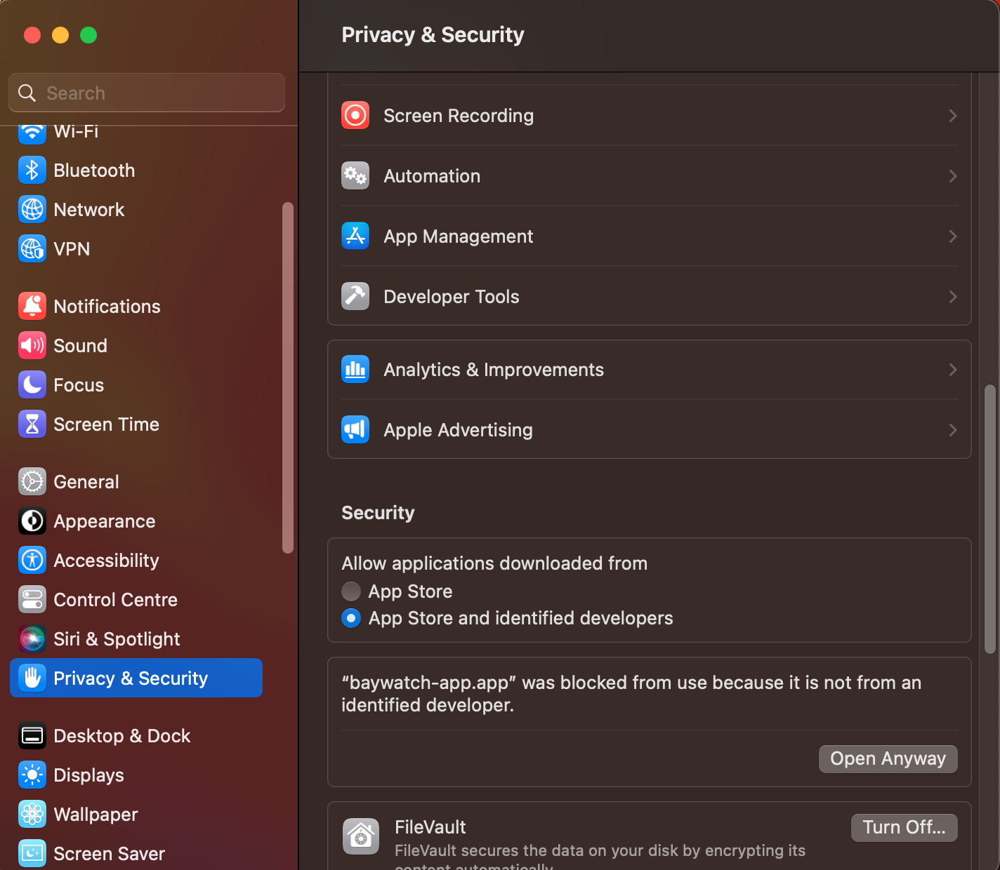

<p align="center">

<p align="center">

## Introduction 

Baywatch app is a tool destined to use easily the baywatch cli. Baywatch cli is useful to switch the context of differents client for the padok run team. But without this tool I kept the decated vscode window opened to quickly respond to the incident. Such as the baywatch app exist, I did not need it again. The app do not consume any cpu and no much RAM, this make it so precious.

This is designed for macos only. The code is written in Swift. Is not an app with windows, is just a menubar, that could be used as shortcut.

At the first install, the setup is automatic like this:

```
.baywatch
├── baywatch-dotfiles
└── config.yaml
```


If one of the folder is missing it will be automaticaly recreated.
The config.yaml files is used to store user data.

The first item of the menu indicates if your directory is uptodate, and it add a shortcut to pull it to be updated.
<p align="center">

<p align="center">


If only terminal command is enabled for a client means this client is not yet configure to used the baywatch cli.


## How to make a new release ?

1. Build the application
1. Click on `product > archive`
1. Wait the "Archiving" to complete, a new popup window will open
1. Click on `Distribute` then select `copy app`, then next
1. Select the forder you want to export the executable to.
1. Create a new release into github and add the package

## How to install ?

1. Download the package v0.1.0
1. Unzip it
1. Add it into your `Applications` folder
1. Then you could start it by clicking into the logo
1. If you respected rules imposed by Kolide you will need to allow baywatch to execute:
1. Go to `System setting > Privacy & Security`
1. Click on open `Open Anyway`
<p align="center">

<p align="center">
