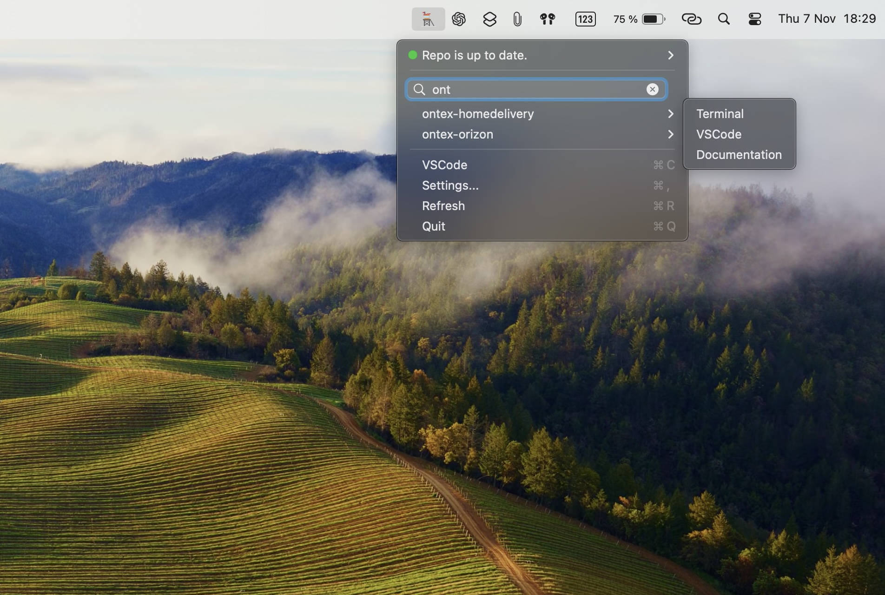
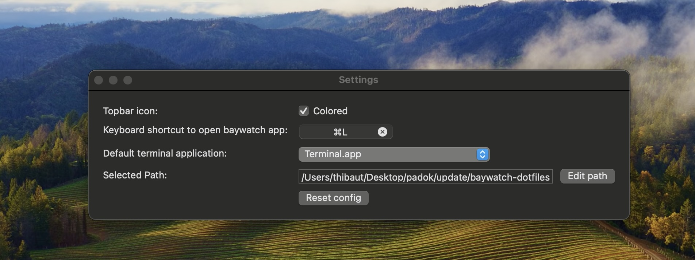

## Introduction 

Baywatch app is a tool to optimise context switching between client base on baywatch-dotfiles repository.

This is designed for macos only. The code is written in Swift. Is not an app with windows, is just a TopBarMenu, that could be used as shortcut.

## Features

### Git Menu

The first item of the menu indicates if your directory is uptodate, and it add a shortcut to pull it to be updated.
The git menu will show you how many commits are behind the HEAD commit on the main branch.
The git menu is refresh when you open baywatch.app menu in async function to not slow down the app.

### Client Menu

The client Menu is composed of a search bar to filter all client items menu. 
When you selected a client, you could:
- open the documentation using the browser
- open the client dotfiles folder in a terminal or in vscode 

### Default Menu

4 functions are available: 
- VScode to open baywatch-dotfiles repository in vscode.
- Settings to open Settings Menu.
- Refresh to force the all view refresh (not very usefull anymore).
- Quit to close baywatch app. 

### Settings Menu

Settings menu allow you to choose :
- if the baywatch app logo is colored.
- what is the global shotcut to open baywatch app menu without using mouse.
- what is your default terminal app that you want to use.
- where is located your baywatch-dotfiles repository.

## How to make a new release ?

1. Build the application
1. Click on `product > archive`
1. Wait the "Archiving" to complete, a new popup window will open
1. Click on `Distribute` then select `copy app`, then next
1. Select the forder you want to export the executable to.
1. Create a new release into github and add the package

## How to install ?

1. Download the package v0.1.0
1. Unzip it
1. Add it into your `Applications` folder
1. Then you could start it by clicking into the logo
1. If you respected rules imposed by Kolide you will need to allow baywatch to execute:
1. Go to `System setting > Privacy & Security`
1. Click on open `Open Anyway`

# Sources

## Global shortcut

For global shortcut I watched [this video](https://www.youtube.com/watch?v=oQL9nrzV_Ok). And I used [KeyboardShortcuts](https://github.com/sindresorhus/KeyboardShortcuts) that works's well.  
